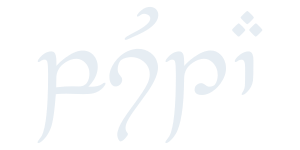

<div align="center">
  <picture>
    <source media="(prefers-color-scheme: dark)" srcset="assets/title-dark.svg">
    <source media="(prefers-color-scheme: light)" srcset="assets/title-light.svg">
    
  </picture>

  <br>

  **pusta schema** contains the yaml schema for [pusta](https://github.com/virtcode/pusta) modules

  <br>

  ---
  
  [Pusta](https://github.com/virtcode/pusta) &ensp; • &ensp; [Issues](../../issues) &ensp;

  ---
</div>

## Usage

The schema is accessiable under the raw GitHub file url. This url can then be used to add schema validator to your editor of choice.

For example when using Visual Studio Code with the [yaml](https://marketplace.visualstudio.com/items?itemName=redhat.vscode-yaml) extension you can add pusta schema validation like this:

```typescript
// vistual studio code user settings (settings.json)

{
    yaml.schemas: {
        "https://raw.githubusercontent.com/WhySoBad/pusta-schema/master/pusta-schema.json": "module.yml"
    }
}

```

## License

This project is licensed under the MIT [License](./LICENSE)